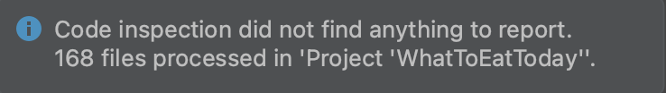

# WhatToEatToday
4156 project

### API Documentation:

[V1.0/RecommendationService-V1.0-api-docs.md](V1.0/RecommendationService-V1.0-api-docs.md)

### Static Analysis (PMD):

[report.md](report.md)

### Style Checker (Alibaba Java Coding Guidelines):




## Build Run Test Guide
We use docker to build a docker image and run the service application. Please make sure you have docker installed on your computer first.

Java or any build tools are not the prerequisite at the build and run stage. So you don't have to install any jdks to run the 
application on docker.

Open a terminal from the project directory and type the below commands.

### 1. Build Docker Image
```
docker build -t recommendation-service-docker:1 .
```
build -t — builds a docker image and tags it to the value that follows -t

recommendation-service-docker:1 — recommendation-service-docker is the image name and 1 is the version of this image. 
This version could be incremented for future images of the same application.

dot (.) — do not miss the dot. It indicates that the Dockerfile is in the current directory.

### 2. Run Docker Image
```
docker run -p 8080:8080 recommendation-service-docker:1
```

run — run the docker image

-p — this is a command to bind the port available in docker to that of the computer that’s hosting the docker.

recommendation-service-demo:1 — Image name that we created in the previous step.

### 3. Test Service

Now you start the service hosted on your computer with the port 8080. You can test all APIs base on the 
[API Documentation](V1.0/RecommendationService-V1.0-api-docs.md) and make sure localhost:8080 is your base url to access
these APIs.

Let's have a quick test on ListAllCategoryName API which responds with names of all categories without requiring a request body.

http://localhost:8080/query/category/list/name (make sure you complete step 2)
